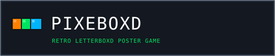

<p align="center">
  
</p>

<p align="center">
  <strong>Guess the Movie by Pixelated Poster — Letterboxd Edition</strong><br>
  <em>Created by <a href="https://davechristopher.me">Dave Christopher</a></em>
</p>

<p align="center">
  <a href="#about-pixeboxd">About</a> •
  <a href="#features">Features</a> •
  <a href="#how-to-play">How to Play</a> •
  <a href="#getting-started">Getting Started</a> •
  <a href="#tech-stack">Tech Stack</a> •
  <a href="#deployment">Deployment</a> •
  <a href="#license">License</a>
</p>

---

## About Pixeboxd

Pixeboxd is an interactive cinephile guessing game where players identify films based on progressively unblurring pixelated movie posters. Inspired by Letterboxd and powered by The Movie Database (TMDB), Pixeboxd challenges film lovers to test their visual memory across curated lists or custom Letterboxd lists imported on the fly.

---

## Features

- **Progressive Canvas Pixelation**: Dynamic HTML5 Canvas rendering starts posters at a retro pixelated resolution and sharpens with each guess.
- **Letterboxd List Integration**:
  - Play with built-in lists: *Letterboxd's Top 500 Films*, *Top 250 Films with the Most Fans*, and the *Letterboxd One Million Watched Club*.
  - **Custom List Importer**: Paste any public Letterboxd list URL to import 30 to 50 films directly into the challenge.
- **Real-Time Autocomplete**: Fast live search dropdown with instant title matching, release years, and ratings.
- **Dynamic Clues**: Unlocks release year, primary genre, and original language as attempts progress.
- **Pixel Confetti Celebration**: Retro pixel block confetti bursts across the screen upon solving the poster.
- **Streak and Game Statistics**: Persistent statistics tracking your games played, win rate, score, and best streaks via local storage.
- **Pure Retro Arcade Aesthetic**: Authentic 8-bit pixel typography using Press Start 2P, CRT scanlines, and tactile 3D pixel buttons.

---

## How to Play

1. **Pick a Film List**: Choose one of the built-in lists (Top 500 Films, Top 250 Films with the Most Fans, or One Million Watched Club), or import any public Letterboxd list URL.
2. **Inspect the Poster**: Review the pixelated artwork on the screen.
3. **Submit Your Guess**: Type the film's title in the search box and select it from autocomplete.
4. **Unlock Clues**: If you guess incorrectly, the poster clarity increases and a new clue (year, genre, or language) is revealed.
5. **Win or Try Again**: Guess the movie within 5 attempts to preserve your streak and score maximum points.

---

## Tech Stack

- **Frontend**: HTML5 Canvas, Vanilla JavaScript, Tailwind CSS
- **Typography**: Press Start 2P (Pixel Font for Game UI and Title)
- **Backend**: Node.js, Express, Vite (Pure JavaScript / ES Modules)
- **Tooling**: Vite, esbuild, Tailwind CSS

---

## Getting Started

### Prerequisites

- Node.js (version 18 or higher recommended)
- npm or bun or yarn

### Installation

1. **Clone the repository**:
   ```bash
   git clone https://github.com/your-username/pixeboxd.git
   cd pixeboxd
   ```

2. **Install dependencies**:
   ```bash
   npm install
   ```

3. **Configure environment variables** (optional):
   Copy `.env.example` to `.env`:
   ```bash
   cp .env.example .env
   ```
   *(A default TMDB API key is already configured for out-of-the-box gameplay, but you can supply your own key in `.env` if desired.)*

4. **Start the development server**:
   ```bash
   npm run dev
   ```

5. Open your browser at http://localhost:3000.

---

## Build for Production

To build the production-ready bundle:

```bash
npm run build
```

To run the compiled server:

```bash
npm start
```

---

## Deployment

Pixeboxd is ready to deploy to any cloud or container platform:

- **Render / Railway / Fly.io**: Connect your GitHub repository and set the start command to `npm start` (with build command `npm run build`).
- **Cloud Run / Docker**: Package using standard Node.js Docker container binding to port 3000.
- **VPS / PM2**: Run with PM2 via `pm2 start dist/server.cjs --name pixeboxd`.

---

## License

This project is licensed under the [MIT License](LICENSE).
